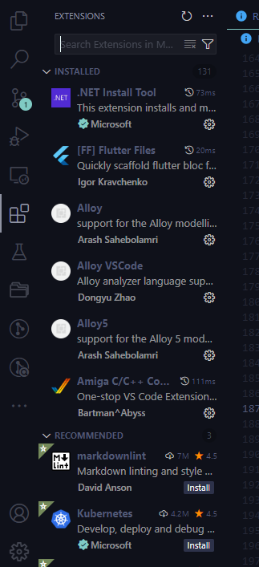
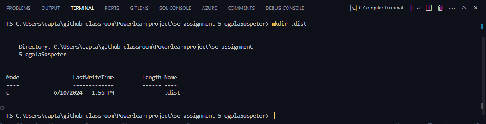

# SE-Assignment-5
Installation and Navigation of Visual Studio Code (VS Code)
 Instructions:
Answer the following questions based on your understanding of the installation and navigation of Visual Studio Code (VS Code). Provide detailed explanations and examples where appropriate.

 Questions:

1. Installation of VS Code:
   - Describe the steps to download and install Visual Studio Code on Windows 11 operating system. Include any prerequisites that might be needed.

To download and install Visual Studio Code on Windows 11, follow these steps:

a. Download VS Code:
Go to the official Visual Studio Code website.
Click on the "Download for Windows" button. This will download the VS Code installer.

b. Run the Installer:
Locate the downloaded installer file (usually in the Downloads folder) and double-click to run it.
Follow the on-screen prompts in the setup wizard:
Accept the license agreement.
Choose the destination folder (the default is usually fine).
Select additional tasks (such as creating a desktop icon, adding to PATH, etc.). It's recommended to check the box for "Add to PATH" for easier command line access.
Click "Install" to begin the installation.

c. Finish Installation:
Once the installation is complete, you can choose to launch VS Code immediately.

d. Prerequisites:
Windows 11.
Administrator privileges to install software.   

2. First-time Setup:
   - After installing VS Code, what initial configurations and settings should be adjusted for an optimal coding environment? Mention any important settings or extensions.

a. Theme and Appearance:
Go to File > Preferences > Color Theme or use Ctrl+K Ctrl+T to select a preferred theme.
Customize the font and editor appearance under File > Preferences > Settings and search for "Font".

b. Extensions:
Install essential extensions by clicking on the Extensions view icon on the Sidebar or pressing Ctrl+Shift+X.
Recommended extensions for web development include:
Prettier - Code formatter
ESLint
Live Server
Debugger for Chrome
Path Intellisense
GitLens — Git supercharged

c. Settings Sync:
Enable Settings Sync (File > Preferences > Settings Sync: Turn On) to synchronize your settings across devices using a GitHub or Microsoft account.

3. User Interface Overview:
   - Explain the main components of the VS Code user interface. Identify and describe the purpose of the Activity Bar, Side Bar, Editor Group, and Status Bar.

a. Activity Bar:
Located on the far left, it allows you to switch between views like Explorer, Search, Source Control, Run and Debug, Extensions, etc.

b. Side Bar:
Displays different panels depending on the Activity Bar selection (e.g., file explorer, search results, source control changes).

c. Editor Group:
The main area where you edit your files. You can split this area into multiple groups for side-by-side editing.

d. Status Bar:
Located at the bottom, it shows information about the current file, such as line and column number, file encoding, and any running processes or errors.

4. Command Palette:
   - What is the Command Palette in VS Code, and how can it be accessed? Provide examples of common tasks that can be performed using the Command Palette.

-> The Command Palette is a powerful feature that allows you to access various commands and settings quickly.
Accessing the Command Palette:
a. Press Ctrl+Shift+P or F1.
   
   ->Common Tasks:
a.Changing the color theme: Preferences: Color Theme.
b.Formatting code: Format Document.
c.Opening settings: Preferences: Open Settings (UI).

5. Extensions in VS Code:
   - Discuss the role of extensions in VS Code. How can users find, install, and manage extensions? Provide examples of essential extensions for web development.

   ->Extensions enhance the functionality of VS Code.

Finding Extensions:
Click on the Extensions view icon or press Ctrl+Shift+X.
Use the search bar to find extensions.
Installing Extensions:

Click the "Install" button on the extension's detail page.

Managing Extensions:
View installed extensions in the Extensions view and disable, uninstall, or configure them as needed.

Essential Extensions for Web Development:
Prettier - Code formatter: Ensures consistent code formatting.
ESLint: Integrates the ESLint JavaScript linter.
Live Server: Launches a local development server with live reload.
Debugger for Chrome: Debugs JavaScript code running in Google Chrome directly from VS Code.
Path Intellisense: Auto-completes filenames.
GitLens: Enhances the Git capabilities in VS Code.

//adding image

6. Integrated Terminal:
   - Describe how to open and use the integrated terminal in VS Code. What are the advantages of using the integrated terminal compared to an external terminal?

   ->Opening the Integrated Terminal:

Use the shortcut Ctrl+` or go to View > Terminal.

Using the Integrated Terminal:
Allows you to run shell commands, scripts, and development servers without leaving the editor.

Advantages:
Integrated with the editor, making it easy to switch between code and terminal.
Supports multiple terminal instances.

//adding image

7. File and Folder Management:
   - Explain how to create, open, and manage files and folders in VS Code. How can users navigate between different files and directories efficiently?

   ->Creating Files and Folders:

Right-click in the Explorer view and select New File or New Folder.
Use the File > New File or File > New Folder menu options.

->Opening Files and Folders:
Drag and drop files/folders into the editor.
Use File > Open File or File > Open Folder.

->Navigating Between Files:
Use Ctrl+P to quickly open files by name.
Use the Explorer view to browse and open files.
Utilize tabs and split editor for managing multiple files.

8. Settings and Preferences:
   - Where can users find and customize settings in VS Code? Provide examples of how to change the theme, font size, and keybindings.

   ->Accessing Settings:

Go to File > Preferences > Settings or use Ctrl+,.

->Changing Theme:
Search for "Color Theme" and select a new theme from the dropdown.

->Adjusting Font Size:
Search for "Editor: Font Size" and change the value.

->Customizing Keybindings:
Go to File > Preferences > Keyboard Shortcuts or use Ctrl+K Ctrl+S to customize shortcuts.

9. Debugging in VS Code:
   - Outline the steps to set up and start debugging a simple program in VS Code. What are some key debugging features available in VS Code?

->Setting Up Debugging:
Open the Run and Debug view by clicking the Debug icon in the Activity Bar or pressing Ctrl+Shift+D.
Click Create a launch.json file to configure debugging for your application.

->Starting a Debugging Session:
Set breakpoints by clicking in the gutter next to the line numbers.
Click the Start Debugging button or press F5.

->Key Debugging Features:
Breakpoints, Step Over/Into/Out, Watch variables, Call stack, and Debug Console.

10. Using Source Control:
    - How can users integrate Git with VS Code for version control? Describe the process of initializing a repository, making commits, and pushing changes to GitHub.

    ->Integrating Git:
Open the Source Control view by clicking the Source Control icon in the Activity Bar or pressing Ctrl+Shift+G.

->Initializing a Repository:
Click Initialize Repository in the Source Control view.

->Making Commits:
Stage changes, write a commit message, and click the checkmark icon to commit.

->Pushing Changes to GitHub:
Click Publish to GitHub in the Source Control view and follow the prompts to push your changes.

 Submission Guidelines:
- Your answers should be well-structured, concise, and to the point.
- Provide screenshots or step-by-step instructions where applicable.
- Cite any references or sources you use in your answers.
- Submit your completed assignment by 1st July 

